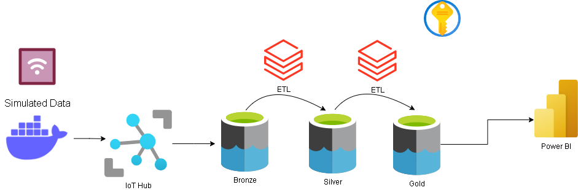
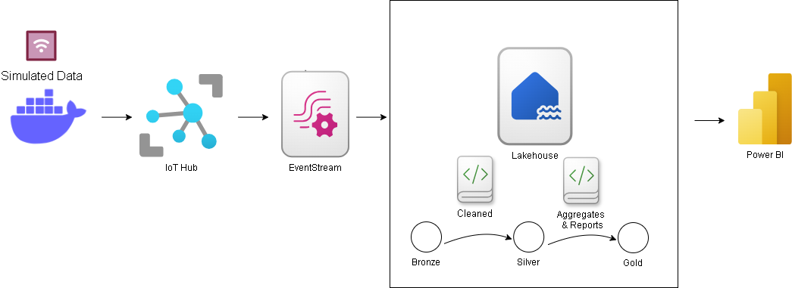
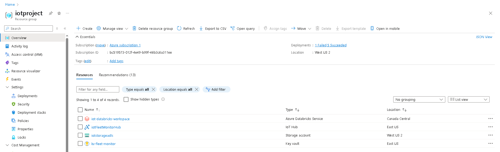
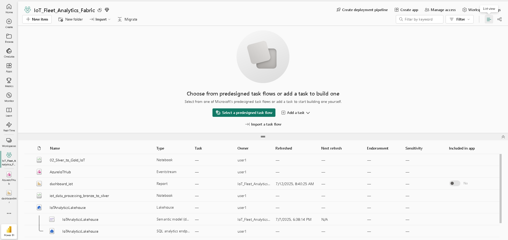
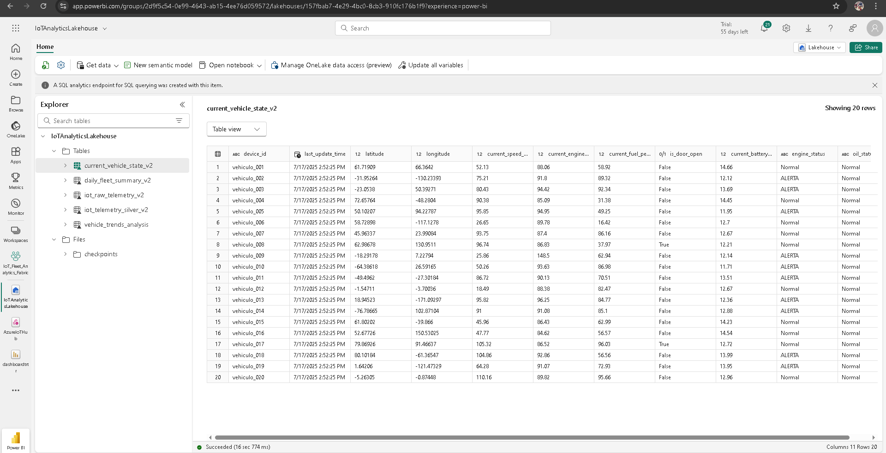
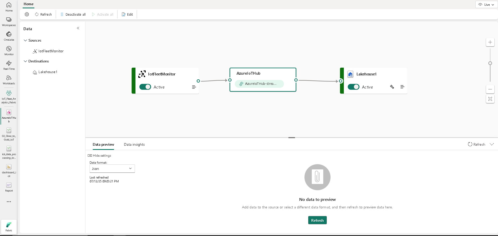
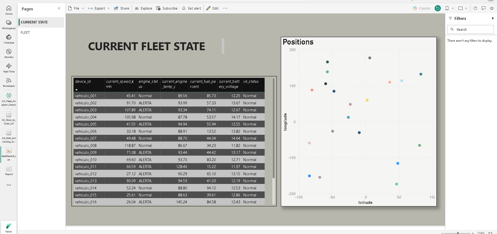
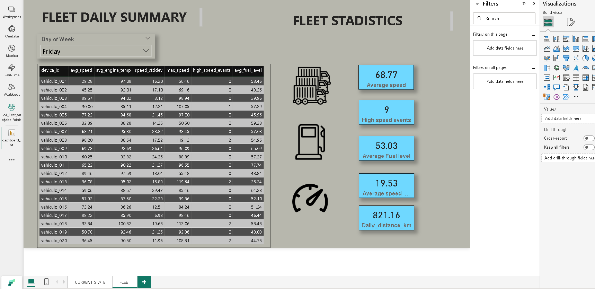

# 🚗 IoT Fleet Monitoring: Azure & Microsoft Fabric Data Pipeline

## ✨ Project Overview
This comprehensive project demonstrates IoT telemetry data processing using **two different Microsoft cloud approaches**: traditional Azure services and the modern Microsoft Fabric platform. The solution simulates vehicle fleet telemetry data and processes it through a structured Medallion Architecture (Bronze, Silver, Gold layers), showcasing versatility across Microsoft's data ecosystem.

**Key Differentiators:**
- **Dual Platform Implementation**: Compare Azure traditional services vs. Microsoft Fabric
- **Medallion Architecture**: Structured data layers for both platforms
- **Real-time Processing**: Streaming data pipelines with anomaly detection
- **Docker Integration**: Containerized IoT data generation
- **Business Intelligence**: End-to-end analytics and visualization

## 🎯 Why This Project?
This project strategically demonstrates enterprise-level data engineering skills across Microsoft's evolving data platform:

**Technical Skills Demonstrated:**
- **Multi-Platform Expertise**: Azure Data Services + Microsoft Fabric
- **Data Lake Architecture**: Medallion pattern implementation
- **Real-time Streaming**: IoT data ingestion and processing
- **Delta Lake Integration**: ACID transactions and schema evolution
- **Container Orchestration**: Docker-based data generation
- **Cloud Security**: Service Principal and Key Vault integration
- **Business Intelligence**: Power BI integration with Direct Lake

## 🏗️ Architecture Comparison

### Azure Architecture


### Microsoft Fabric Architecture


## 🛠️ Technology Stack

### Core Technologies
- **Python**: Data generation and processing
- **Docker**: Containerized IoT simulator
- **Apache Spark (PySpark)**: Data transformations
- **Delta Lake**: Reliable data storage format
- **Apache Avro/Parquet**: Data serialization formats

### Azure Stack
- **Azure IoT Hub**: Scalable telemetry ingestion
- **Azure Data Lake Storage Gen2**: Multi-layer data storage
- **Azure Databricks**: Managed Spark platform
- **Azure Key Vault**: Secure credential management

### Microsoft Fabric Stack
- **Microsoft Fabric Eventstream**: Real-time data ingestion
- **Microsoft Fabric Lakehouse**: Unified analytics platform
- **Microsoft Fabric Notebooks**: Integrated PySpark environment
- **Power BI Direct Lake**: High-performance analytics

## 📊 Data Pipeline Architecture

### Bronze Layer (Raw Ingestion)
- **Source**: IoT Hub Eventstream
- **Format**: JSON telemetry from 20 vehicles
- **Frequency**: Real-time streaming (~3.1 messages/second)
- **Schema**: Flexible JSON schema evolution
- **Storage**: iot_raw_telemetry_V2 table

### Silver Layer (Cleaned & Structured)
- **Processing**: PySpark streaming (1-minute triggers)
- **Transformations**:
  - Unix timestamp → DateTime conversion
  - Schema validation and typing
  - Data quality checks
  - Partitioning by event_date
- **Checkpoint**: Fault-tolerant streaming
- **Storage**: iot_telemetry_silver_V2 table

### Gold Layer (Analytics-Ready)
- **Processing**: Batch aggregations with advanced analytics
- **Tables**:
  - current_vehicle_state_V2: Real-time fleet status
  - daily_fleet_summary_V2: Daily KPIs and metrics
  - vehicle_trends_analysis: Behavioral patterns by hour
- **Features**: Window functions, percentiles, anomaly detection

## ⚙️ IoT Data Simulator Configuration

### Default Configuration
```python
num_vehicles = 20           # Fleet size
days_to_simulate = 7        # Simulation period
real_time_duration = 3600   # 1 hour real-time execution
simulated_interval_minutes = 180  # 3 hours per message
```


Generated Telemetry Schema
```
json

{
  "deviceId": "vehiculo_001",
  "timestamp": 1704110400000,
  "latitude": 40.7128,
  "longitude": -74.0060,
  "speed_kmh": 65.5,
  "engine_temp_c": 89.2,
  "vibration_level": 0.3,
  "fuel_level_percent": 78.0,
  "door_open": false,
  "fuel_type": "Gasoline",
  "battery_voltage": 13.2,
  "oil_pressure_kpa": 320,
  "engine_rpm": 2800,
  "odometer_km": 45623.45
}
```
Vehicle Behavior Patterns

- Urban Pattern: 10-60 km/h, 1000-3000 RPM
- Highway Pattern: 80-120 km/h, 2500-4500 RPM
- Mixed Pattern: 20-100 km/h, 1500-4000 RPM
- Anomaly Generation: 5% probability of engine overheating (>120°C) 


## 🚀 Implementation Guide

✅ Step 1: IoT Data Generation

```bash
# Build and run Docker container
cd docker/
docker build -t iot-fleet-simulator .
docker run -e IOTHUB_DEVICE_CONNECTION_STRING="your_connection_string" iot-fleet-simulator
```


### Azure Implementation
1. **IoT Hub**: Device registration and connection string setup
2. **Databricks**:
   - 01_bronze_to_silver.py: Avro to cleaned Delta
   - 02_silver_to_gold.py: Aggregated tables (current_state, fleet_summary, trends)
3. **Data Lake**: Organize into Bronze/Silver/Gold containers
4. **Power BI**: Connect via Azure connector

### 🟣 Fabric Implementation
1. **Eventstream**: Configure IoT Hub source
2. **Lakehouse**:
   Bronze: Auto-ingestion from Eventstream
   Silver: Deploy streaming notebook (iot_data_processing_bronze_to_silver.ipynb)
   Gold: Deploy aggregation notebook (02_Silver_to_Gold_IoT.ipynb)
3. **Power BI**: Connect via Direct Lake for instant access


### 📊 Analytics Capabilities

**Real-time Monitoring**

- Vehicle Status: Current location, speed, engine health
- Fleet Overview: Active vehicles, alerts, performance metrics
- Anomaly Detection: Engine temperature >90°C, Oil pressure <100kPa
- Geospatial Tracking: Live vehicle positioning

**Historical Analysis**

- Trend Analysis: Speed patterns by hour of day
- Performance Metrics: P95 engine temperature, fuel efficiency trends
- Behavioral Insights: Urban vs highway driving patterns
- Maintenance Predictions: Based on engine temperature and vibration

**Business Intelligence**

- KPIs: Average speed, fuel consumption, maintenance alerts
- Dashboards: Real-time Power BI with DirectLake connectivity


## 📊 Results and Visualizations

### 🔄 Deployment Snapshots & Resources
- **Azure Resource Group**


- **Microsoft Fabric Workspace**


- **Microsoft Fabric Lakehouse Overview**


- **Fabric Eventstream**


### 📈 Power BI Dashboards
- **Fleet State**: Live engine, oil, location, velocity


- **Daily Summary (Aggregates)**


## 🧠 Business Use Cases
- Real-time vehicle & fleet monitoring
- Operational KPI dashboards
- Foundation for anomaly detection and route optimization

## 📁 Project Structure

iot-fleet-monitoring/
├── docker/
│ ├── Dockerfile
│ ├── requirements.txt
│ └── iot_data_generator.py
├── azure-implementation/
│ ├── notebooks/
│ │ ├── 01_bronze_to_silver.py
│ │ ├── 02_silver_to_gold.py
│ │ └── 03_anomaly_detection.py
│ └── config/
├── fabric-implementation/
│ └── notebooks/
│ ├── 01_Bronze_to_Silver_IoT.ipynb
│ └── 02_Silver_to_Gold_IoT.ipynb
└── README.md

## 🎯 Key Value Proposition

### Technical Highlights
- **End-to-End Medallion Architecture**: Bronze (raw) → Silver (cleaned) → Gold (enriched) data layers with Delta Lake
- **Real-time & Batch Processing**: Streaming ingestion with anomaly detection + historical analytics
- **Cloud-Native Design**: Containerized data generation, managed Spark, and secure credential handling

### Business Impact
**Fleet Operations:**
- Live vehicle tracking and diagnostics
- Predictive maintenance alerts
- Route optimization insights
- Automated compliance reporting

**Business Intelligence:**
- Unified dashboards (real-time + historical)
- Fleet utilization analytics
- Cost optimization metrics
- Driver/vehicle performance benchmarking

🚀 Future Enhancements

- Machine Learning: Predictive maintenance models with Azure ML/Fabric ML
- Cost Optimization: Automated scaling based on usage patterns


## 📞 Contact & Support
- **Project Maintainer**: [Your Name]
- **Email**: [your.email@example.com]
- **LinkedIn**: [Your LinkedIn Profile]
- **Issues**: [GitHub Issues Page]

---
*This project demonstrates real-world data engineering practices using Microsoft's cloud platforms. It's designed to showcase technical skills while solving practical business problems in IoT fleet management.*
