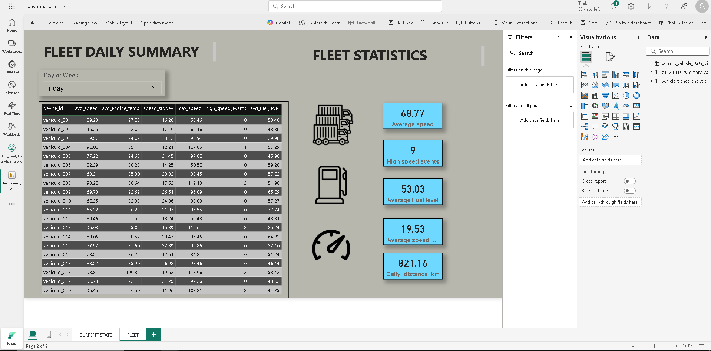

# 🚗 IoT Fleet Monitoring: Azure & Microsoft Fabric Data Pipeline

## ✨ Project Overview
This comprehensive project demonstrates IoT telemetry data processing using **two different Microsoft cloud approaches**: traditional Azure services and the modern Microsoft Fabric platform. The solution simulates vehicle fleet telemetry data and processes it through a structured Medallion Architecture (Bronze, Silver, Gold layers), showcasing versatility across Microsoft's data ecosystem.

**Key Differentiators:**
- **Dual Platform Implementation**: Compare Azure traditional services vs. Microsoft Fabric
- **Medallion Architecture**: Structured data layers for both platforms
- **Real-time Processing**: Streaming data pipelines with anomaly detection
- **Docker Integration**: Containerized IoT data generation
- **Business Intelligence**: End-to-end analytics and visualization

## 🎯 Why This Project?
This project strategically demonstrates enterprise-level data engineering skills across Microsoft's evolving data platform:

**Technical Skills Demonstrated:**
- **Multi-Platform Expertise**: Azure Data Services + Microsoft Fabric
- **Data Lake Architecture**: Medallion pattern implementation
- **Real-time Streaming**: IoT data ingestion and processing
- **Delta Lake Integration**: ACID transactions and schema evolution
- **Container Orchestration**: Docker-based data generation
- **Cloud Security**: Service Principal and Key Vault integration
- **Business Intelligence**: Power BI integration with Direct Lake

## 🏗️ Architecture Comparison

### Azure Architecture

### Microsoft Fabric Architecture

## 🛠️ Technology Stack

### Core Technologies
- **Python**: Data generation and processing
- **Docker**: Containerized IoT simulator
- **Apache Spark (PySpark)**: Data transformations
- **Delta Lake**: Reliable data storage format
- **Apache Avro/Parquet**: Data serialization formats

### Azure Stack
- **Azure IoT Hub**: Scalable telemetry ingestion
- **Azure Data Lake Storage Gen2**: Multi-layer data storage
- **Azure Databricks**: Managed Spark platform
- **Azure Key Vault**: Secure credential management

### Microsoft Fabric Stack
- **Microsoft Fabric Eventstream**: Real-time data ingestion
- **Microsoft Fabric Lakehouse**: Unified analytics platform
- **Microsoft Fabric Notebooks**: Integrated PySpark environment
- **Power BI Direct Lake**: High-performance analytics

## 🚀 Implementation Guide

### ✅ Shared Step: Simulate IoT Data
- Run iot_data_generator.py in Docker
- Sends data to Azure IoT Hub

### Azure Implementation
1. **IoT Hub**: Device registration and connection string setup
2. **Databricks**:
   - 01_bronze_to_silver.py: Avro to cleaned Delta
   - 02_silver_to_gold.py: Aggregated tables (current_state, fleet_summary, trends)
3. **Data Lake**: Organize into Bronze/Silver/Gold containers
4. **Power BI**: Connect via Azure connector or SQL endpoint

### 🟣 Fabric Implementation
1. **Eventstream**: Ingest from IoT Hub
2. **Lakehouse**:
   - Bronze: iot_raw_telemetry_v2
   - Silver: Streaming notebook applies schema validation, partitioning, enrichment
   - Gold Tables:
     - current_vehicle_state_v2 → Latest vehicle status
     - daily_fleet_summary_v2 → Daily KPIs
3. **Power BI**: Connect via Direct Lake for instant access

## 📊 Results and Visualizations

### 🔄 Deployment Snapshots & Resources
- **Azure Resource Group**

- **Microsoft Fabric Workspace**

- **Microsoft Fabric Lakehouse Overview**

- **Fabric Eventstream**

### 📈 Power BI Dashboards
- **Fleet State**: Live engine, oil, location, velocity

- **Daily Summary (Aggregates)**

## 🧠 Business Use Cases
- Real-time vehicle & fleet monitoring
- Operational KPI dashboards
- Foundation for anomaly detection and route optimization

## 📁 Project Structure

iot-fleet-monitoring/
├── docker/
│ ├── Dockerfile
│ ├── requirements.txt
│ └── iot_data_generator.py
├── azure-implementation/
│ ├── notebooks/
│ │ ├── 01_bronze_to_silver.py
│ │ ├── 02_silver_to_gold.py
│ │ └── 03_anomaly_detection.py
│ └── config/
├── fabric-implementation/
│ └── notebooks/
│ ├── 01_Bronze_to_Silver_IoT.ipynb
│ └── 02_Silver_to_Gold_IoT.ipynb
└── README.md

## 🎯 Key Value Proposition

### Technical Highlights
- **End-to-End Medallion Architecture**: Bronze (raw) → Silver (cleaned) → Gold (enriched) data layers with Delta Lake
- **Real-time & Batch Processing**: Streaming ingestion with anomaly detection + historical analytics
- **Cloud-Native Design**: Containerized data generation, managed Spark, and secure credential handling

### Business Impact
**Fleet Operations:**
- Live vehicle tracking and diagnostics
- Predictive maintenance alerts
- Route optimization insights
- Automated compliance reporting

**Business Intelligence:**
- Unified dashboards (real-time + historical)
- Fleet utilization analytics
- Cost optimization metrics
- Driver/vehicle performance benchmarking

## 📞 Contact & Support
- **Project Maintainer**: [Your Name]
- **Email**: [your.email@example.com]
- **LinkedIn**: [Your LinkedIn Profile]
- **Issues**: [GitHub Issues Page]

---
*This project demonstrates real-world data engineering practices using Microsoft's cloud platforms. It's designed to showcase technical skills while solving practical business problems in IoT fleet management.*
